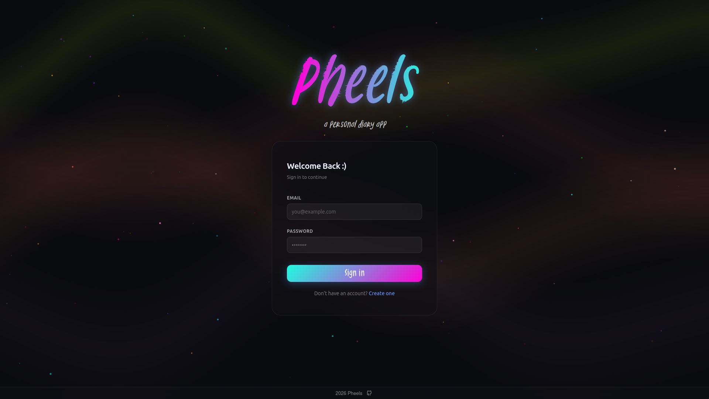

# Pheels: A Personal Diary App

A journaling and mood diary web app written in TypeScript.



## 🚀 Features

- **Journal Entries** — create, read, edit, and delete your personal journal entries
- **Mood Diary** — log your daily mood with emoji-based tracking
- **Account Management** — update username, change password, delete account
- **Authentication** — JWT-based authentication
- **Light / Dark Mode** — full theme support

## 🛠️ Tech Stack

- **Backend**: Node.js, Express.js
- **Database**: MongoDB with Mongoose ODM
- **Frontend**: React, TypeScript, Vite
- **UI**: Mantine UI

## 📋 Requirements

- [Node.js]
- [MongoDB] installed and running locally, or a MongoDB Atlas account
- [NPM] package manager

## Installation & Setup

### 1. Clone or Download this Project

```bash
cd pheels
```

### 2. Install Dependencies

```bash
# install frontend dependencies
cd client
npm install
```

```bash
# install backend dependencies
cd api
npm install
```

### 3. Environment Configuration

Create a `.env` file in the `/api` directory:

```env
MONGODB_URI=[your_mongodb_uri]
JWT_SECRET=[your_jwt_secret]
PORT=[your_port_number]
```

Create a `.env` file in the `/client` directory:

```env
VITE_API_URL=http://localhost:[your_vite_port_number]
```

### 4. Running the Application

```bash
# run frontend
cd client
npm run dev

# run backend
cd api
node index.js
```

Frontend available at `http://localhost:[your-frontend-port-number]`

Backend available at `http://localhost:[your-backend-port-number]`

## 📁 Project Structure

```
pheels/
├── client/                  # Frontend
│   ├── index.html
│   ├── package.json
│   ├── src/
│   │   ├── Components/      # React components
│   │   ├──── Animations/    # Animations
│   │   ├──── Modals/        # Popup Modals
│   │   ├──── Pages/         # App Pages
│   │   ├──── Tabs/          # Home Page Tabs
│   │   ├──── UI/            # Various UI Elements
│   │   └── Fonts/           # Custom Fonts
│   ├── .env                 # Environment variables (YOU SUPPLY THIS)
│   └── public/
│
├── api/                     # Backend
│   ├── index.js             # Express server & Routes
│   ├── models/              # Mongoose schemas
│   │   ├── journal.js
│   │   ├── mood.js
│   │   ├── profile.js
│   │   └── user.js
│   ├── middleware/
│   │   └── auth.js          # JWT middleware
│   ├── .env                 # Environment variables (YOU SUPPLY THIS)
│   └── package.json
└── README.md
```

## 🔌 API Endpoints

### Auth
| Method | Endpoint | Description           |
|--------|----------|-----------------------|
| POST | `/api/signup` | Create a new account  |
| POST | `/api/login` | Login and receive JWT |
| GET | `/api/verify` | Verify JWT            |

### Profile
| Method | Endpoint | Description      |
|--------|----------|------------------|
| GET | `/api/profile` | Get user profile |
| PATCH | `/api/profile` | Update profile   |

### Journals
| Method | Endpoint | Description |
|--------|----------|-------------|
| GET | `/api/journals` | Get all journal entries |
| POST | `/api/journals` | Create a journal entry |
| PATCH | `/api/journals/:id` | Update a journal entry |
| DELETE | `/api/journals/:id` | Delete a journal entry |

### Moods
| Method | Endpoint | Description |
|--------|----------|-------------|
| GET | `/api/moods` | Get all mood entries |
| POST | `/api/moods` | Log a mood |
| DELETE | `/api/moods/:id` | Delete a mood entry |

### Account
| Method | Endpoint | Description |
|--------|----------|-------------|
| PATCH | `/api/user/password` | Change password |
| DELETE | `/api/user/:id` | Delete account |